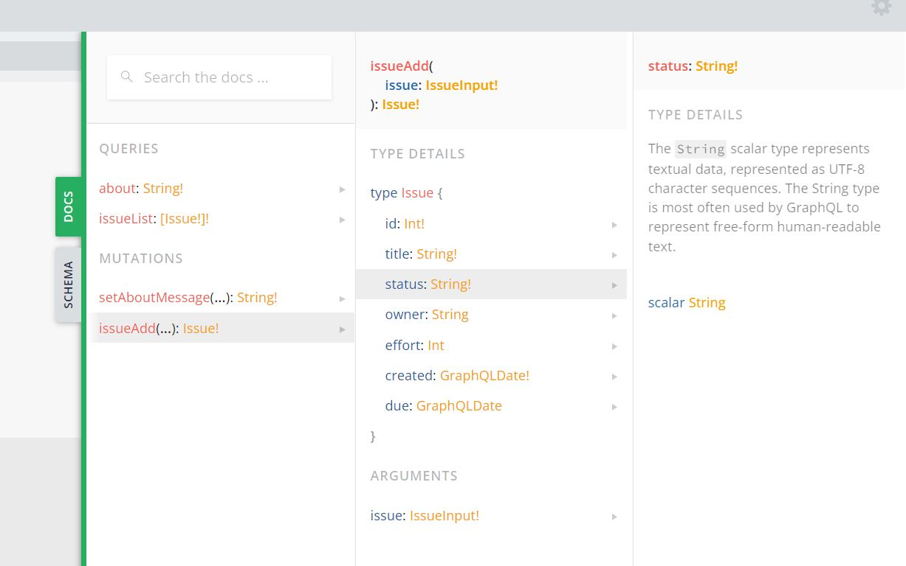

# Create API 

In this section, we will implement an API for creating a new issue in the server, which will be appended to the list of issues in the server’s memory.
To do this, we have to first define a field in the schema under Mutation called issueAdd. This field should take arguments, just as the setAboutMessage field did. But this time, we need multiple arguments, one for each property of the issue being added. Alternatively, we can define a new type as an object that
has the fields we need for the input. This can’t be the same as the Issue type because it has some required fields (id and created) that are not part of the input. These are values that are set by the server only. Further, GraphQL needs a different specification when it comes to input types. Instead of using the type keyword, we
have to use the input keyword. Let’s first define this new input type called IssueInputs in the schema:

```js
...
input IssueInput {
  # ... fileds of Issue
}
...
```

We discussed how to add comments in the schema. But these comments are not formal descriptions of the types or subfields. For real documentation that is shown part of the schema explorer, a string above the field needs to be added. When the schema is shown to an exploring developer, these descriptions will appear as helpful hints. So, let’s add a description for IssueInputs as well as for the property status, saying it will be defaulted to the value 'New' if not supplied:
  
```js
...
"Toned down Issue, used as inputs, widouth server generated values"
input IssueInput {
  ...
  "Optional, if not specified, will be set to 'New'"
  status: String
  ...
}
...
```

Now, we can use the type IssueInputs as the argument type to the new issueAdd field under Mutation. The return value of this field can be anything. It is usually good practice to return the values generated at the server, typically the ID of the new object. In this case, since both the ID and the created date are set at the
server, let’s return the entire issue object that was created.

<pre>
<b>"Toned down Issue, used as inputs, widouth server generated values"
input IssueInput {
  title: String!
  "Optional, if not specified, will be set to 'New'"
  status: String
  owner: String
  effort: String
  due: GraphQLDate
}</b>

### Top level declaration
...
type Mutation {
  setAboutMessage(message: String!): String!
  <b>issueAdd(issue: IssueInput!): Issue!</b>
}
</pre>

Next, we need a resolver for issueAdd that takes in an IssueInput type and creates a new issue in the in-memory database.

```js
...
  function issueAdd(_, { issue })
  {
  ...
  }
...
```

In the function, let’s set the ID and the created date as we did in the browser:

```js
...
  issue.created = new Date();
  issue.id = issesDB.length + 1;
...
```

Further, let’s also default the status, if not supplied (since we have not declared it as a required subfield) to the value 'New':

```js
...
if (issue.status == undefined) issue.status = 'New'; 
...
```

Finally, we can append the issue to the global variable issuesDB and return the issue object as is:

```js
...
issuesDB.push(issue);
return issue;
...
```

This function now can be set as the resolver for the issueAdd field under Mutation

<pre>
...
Mutation {
  setAboutMessage,
  <b>issueAdd,</b>
},
...
</pre>

We had postponed implementing the parsers for the custom scalar type GraphQLDate because we didn’t need it then. But now, since the type IssueInputs does have a GraphQLDate type, we must implement the parsers for receiving date values. There are two methods that need to be implemented in the GraphQLDate resolver: parseValue and parseLiteral.
The method parseLiteral is called in the normal case, where the field is specified in-place in the query. The parser calls this method with an argument ast, which contains a kind property as well as a value property. The kind property indicates the type of the token that the parser found, which can be a float, an integer, or a string. For GraphQLDate, the only type of token we’ll need to support is a string. We can check this using a constant defined in the Kind package in graphql/language. If the type of token is string, we will parse the value and return a date. Otherwise, we’ll return undefined. Here’s the implementation of parseLiteral:

```js
...
parseLiteral(ast) {
  return (ast.kind == Kind.STRING) ? new Date(ast.value) : undefined;
}
...
```

A return value of undefined indicates to the GraphQL library that the type could not be converted, and it will be treated as an error. 
The method parseValue will be called if the input is supplied as a variable. I will cover variables in the query input in a later section in this chapter, but at the moment, consider it as an input in the form of a JavaScript object, a pre-parsed JSON value. This method’s argument will be the value directly, without a kind
specification, so all we need to do is construct a date out of it and return it like this:

```js
...
parseValue(value) {
  return new Date(value);
},
...
```

The complete set of changes to server.js is shown in Listing

<pre>
...
const { GraphQLScalarType } = require('graphql');
<b>const { Kind } = require('graphql/language');</b>
...
const GraphQLDate = new GraphQLScalarType({
  ...
  <b>parseValue(value) {
    return new Date(value);
  }
  parseLiteral(ast) {
    return (ast.kind == Kind.STRING) ? new Date(ast.value) : undefined;
  },</b>
});
...
const resolver = {
  Mutation {
    setAboutMessage,
  <b>  issueAdd,</b>
  },
  GraphQLDate
}
...
<b>function issueAdd(_, { issue }) {
  issue.created = new Date();
  issue.id = issueDB.length + 1;
  if (issue.status == undefined) issue.status = 'New';
  issuesDB.push(issue);
  return issue;
}</b>
</pre>

Now we are ready to test the Create API using the Playground. If you explore the schema in the Playground (a browser refresh may be needed) and drill down to the status field of IssueInputs, you will find the descriptions that we provided in the schema. 



To test the addition of a new issue, you can use the following query in the Playground:
<hr>
```js
mutation {
  issueAdd(
    issue: {
      title: "Completion date should be optional"
      owner: "Pieta"
      due: "2018-12-13"
    }
  ) {
    id
    due
    created
    status
  }
}
```
Running this query should give the following result in the result window of the Playground:
<hr>

```js
{
  "data": {
    "issueAdd": {
      "id": 3,
      "due": "2018-12-13T00:00:00.000Z",
      "created": "2022-04-16T07:27:11.439Z",
      "status": "New"
    }
  }
}
```

This shows that the due date has been properly parsed and converted. The status field also has been defaulted to 'New' as expected. You can also confirm that the issue has been created by running a query for issueList in the Playground and checking the results.
