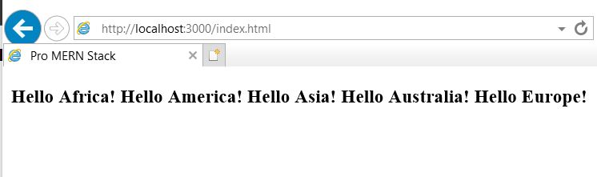

# NodeJs

## older browser support

JavaScript code will work in all modern browsers that support ES2015. The older browsers don’t support things like Arrow Functions and the Array.from() method.

 > Let’s make some changes to the JavaScript and React to use some of these advanced ES2015 features
 > Then, let’s make changes to support all these features in older browsers as well

Babel is capable of transforming newer JavaScript features into older JavaScript, that is, ES5.

 > there is a plugin for each of these features

Plugin called plugintransform-arrow-functions. We can install this plugin and use it in addition to the React preset like this:<br />

`$ npm install --no-save @babel/plugin-transform-arrow-functions@7`

<br />
We used the --no-save install option because this is a temporary installation, and we don’t want
package.json to change because of the temporary installation.<br />

 > transform the source file like this

```
 npx babel src --presets @babel/react 
--plugins=@babel/plugin-transform-arrow-functions --out-dir public
```

Choeckout the output of the transform, App.js, you will see that arrow functions have been
replaced with regular functions.

 > How does one know which plugins have to be used?

Babel does the job of automatically figuring this out via a preset called preset-env. This preset lets us specify the target browsers that we need to support and automatically applies all the transforms and plugins that are required to support those browsers.

 > uninstall the transform-arrow-function preset
 > install instead the env preset that includes all the other plugins.

`npm uninstall @babel/plugin-transform-arrow-functions@7`
`npm install --save-dev @babel/preset-env@7`

### Configuration File

Instead of using the command-line (which can get quite lengthy if we do use it), let’s specify the presets that need to be used in a configuration file.

 > Babel looks for this in a file called **.babelrc**

Since we have all the client-side code in the directory called src, let’s create this file in that
directory.

 > .babelrc file is a JSON file, which can contain presets as well as plugins
```
{
 "presets": ["@babel/preset-env", "@babel/preset-react"]
}
```

The preset preset-env needs further configuration to specify target browsers and their versions.
**Targets** is an object with the key as the browser name and the value as its targeted version:

```
["@babel/preset-env", {
 "targets": {
 "safari": "10",
 ...
  }
 }]
 ```
 > include support for IE version 11 and slightly older versions of the other popular browsers

 - The complete configuration file is shown src/.babelrc

 ```
{
    "presets": [
        ["@babel/preset-env", {
            "targets": {
                "ie": "11",
                "edge": "15",
                "safari": "10",
                "firefox": "50",
                "chrome": "49"
            }
        }],
        "@babel/preset-react"
    ]
}
 ```

 >  Now run babel command without specifying any presets on the command-line:
 `npx babel src --out-dir public`

 ### Note

Inspect the generated App.js<br />
 > arrow function has been replaced with a regular function
 > string interpolation has been replaced with a string concatenation

if you test on an Internet Explorer version 11, the code will still not work. All such function implementations to supplement the missing implementation in older browsers are called polyfills.

 > Babel provides these polyfills too
 > They need to be included in the HTML file to make these functions available
 
 - changes to index.html

<pre>
...
 <script src="https://unpkg.com/react-dom@16/umd/react-dom.development.js"></script>
 <b><script src="https://unpkg.com/@babel/polyfill@7/dist/polyfill.min.js"></script</b>
</head>
...
</pre>

 > Now, the code can work on Internet Explorer as well
<br />
