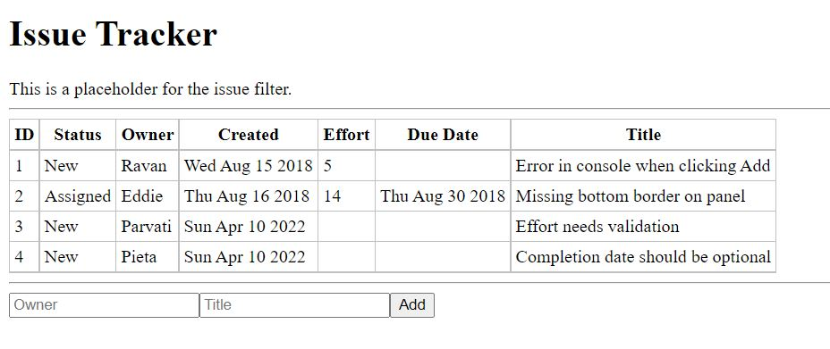
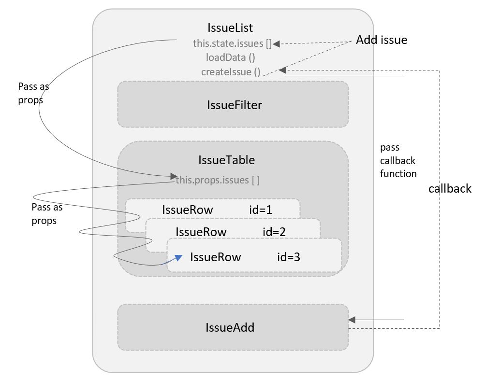

# Event Handling

Let’s now add an issue interactively, on the click of a button rather than use a timer to do this. We’ll create a form with two text inputs and use the values that the user enters in them to add a new issue. An Add button will trigger the addition.

Let’s start by creating the form with two text inputs in the `render()` method of IssueAdd in place of the placeholder div.

```js
  ...
  <form>
    <input title="owner" type=text placehodler="Owner" />
    <input title="title" type=text placehodler="Title" />
    <button>Add</button>
  </form>
  ...
```

Remove the timer that creates an issue from the constructor.

<pre>
...
constructor() {
  super();
  <del>setTimeout(()=>{
    this.props.createIssue( sampleIssue );
    }, 2000);</del>
}
</pre>

At this point, clicking Add will submit the form and fetch the same screen again. That’s not what we want. Firstly, we want it to call createIssue() using the values in the owner and title fields. Secondly, we want to prevent the form from being submitted because we will handle the event ourselves.
We’ll create a class method called `handleSubmit()` to receive the submit event from the form whenthe Add button is clicked.

```js
...
  <form name="issueAdd" onSubmit={handleSubmit} >
  ...
```

Now, we can implement the method `handleSubmit()` in IssueAdd. This method receives the event that triggered the submit as an argument. In order to prevent the form from being submitted when the Add button is clicked, we need to call the `preventDefault()` function on the event. Then, using the form handle via `documents.forms.issueAdd`, we can get the values of the text input fields. Using these, we’ll create a new issue by calling `createIssue()`.

```js
...
handleSubmit(e) {
  e.preventDefault();
  const form =  documents.forms.issueAdd;
  const issue = {
    owner: form.owner.value, title: form.title.value, status: 'New'
  }
  this.props.createIssue(issue);
  form.owner.value= ""; form.title.value = "";
}
...
```

Since handleSubmit will be called from an event, the context, or this will be set to the object generating the event, which is typically the window object. As you saw in the previous section, to let this method have access to the object variables via this, we need to bind it to this in the constructor:

<pre>
  constructor() {
    super();
    <b>this.handleSubmit = this.handleSubmit.bind(this);</b>
}
...
</pre>

The global object sampleIssue is no longer required, so we can get rid of it.

<pre>
...<del>
const sampleIssue = {
 status: 'New', owner: 'Pieta',
 title: 'Completion date should be optional',
};</del>
...
</pre>



Component hierarchy and data flow after lifting state up

<br />
