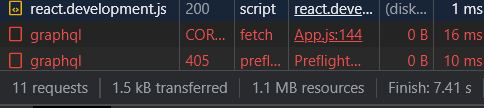
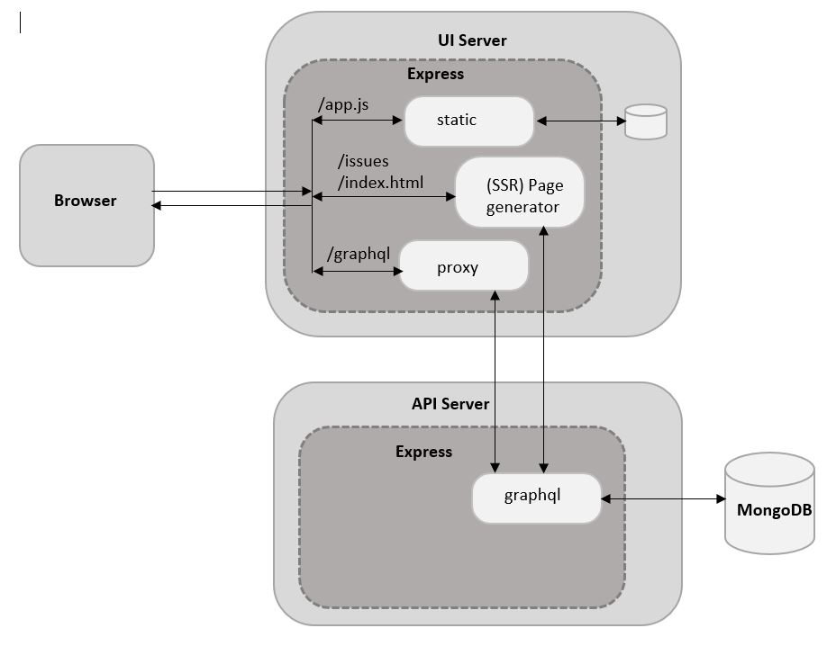

# Proxy Based Architecture

If you had your Network tab open in the Developer Console while testing, you would have noticed that there are two calls to /graphql instead of just one. The HTTP method for the first call is OPTIONS. The reason is that the API call is to a host (http://localhost:3000) that is different from the origin of the application (http:// localhost:8000). Due to the Same-origin policy, such requests are normally blocked by the browser unless the server specifically allows it.

The Same-origin policy exists to prevent malicious websites from gaining unauthorized access to the
application. The gist of it is that since cookies set by one origin are automatically attached with any request to that origin, it is possible that a malicious website can make a call to the origin from the browser and the browser will attach the cookie.

Say you are logged into a bank’s website. In another browser tab, you are browsing some news website
that has some malicious JavaScript running in it, maybe via an advertisement on the website. If this
malicious JavaScript makes an Ajax call to the bank’s website and the cookies are sent as part of the request, the malicious JavaScript can end up impersonating you and maybe even transferring funds to the hacker’s account!
So, browsers prevent this by requiring that such requests be explicitly permitted. The kind of requests
that can be permitted is controlled by the Same-origin policy as well as parameters controlled by the server, which determines if the request can be allowed. This mechanism is called cross-origin resource sharing or CORS for short. The Apollo GraphQL server, by default, allows unauthenticated requests across origins. The following headers in the response to the OPTIONS request shows this:

<pre>
Access-Controll-Allow-Headers: content-type
Access-Controll-Allow-Methods: GET,HEAD,PUT,PATCH,POST,DELETE
Access-Controll-Allow-Origin: *
</pre>

Let’s disable the default behavior of the Apollo server (using, of course, an environment variable) and
check out the new behavior of the API server. Let’s call this environment variable ENABLE_CORS and set the api/.env file to false (the default being true, the current behavior).

```
...
## ENABLE CORS (default: true)
ENABLE_CORS=false
...
```

Now, in server.js in the API, let’s look for this environment variable and set an option called cors to
true or false, depending on this variable. The changes to api/server.js are shown:

<pre>
...
const app = express();

<b>const enableCors = (process.env.ENABLE_CORS || 'true') == 'true';
console.log('CORS settings:', enableCors);</b>
server.applyMiddleware({ app, path: '/graphql'<b>, cors: enableCors</b> });
...
</pre>

If you test the application, you will find that the OPTION request fails with an HTTP response of 405.
Now, the application is safe from malicious cross-site attacks. But this also means that we need some other mechanism to make API calls.



I’ll discuss CORS in more detail and why it’s safe to enable CORS at the current stage of the application, where all resources are publicly available without authentication. But let’s also look at alternatives for the sake of security. In this section, we’ll change the UI to make even API requests to the UI server, where we will install a proxy so that any request to /graphql is routed to the API server. This new architecture is depicted in Figure 7-4.



<i><b>Figure 7-4.</b> Proxy-based architecture</i>

Such a proxy can be easily implemented using the http-proxy-middleware package. Let’s install this
package:

<pre>
$ cd ui
$ npm install http-proxy-middleware@0
</pre>

Now, a proxy can be used as a middleware that the package provides, mounted on the path /graphql,
using app.use(). The middleware can be created with just a single option: the target of the proxy, which is the base URL of the host where the requests have to be proxied. Let’s define another environment variable called API_PROXY_TARGET and use its value as the target. If this variable is undefined, we can skip installing the proxy rather than default it.
The changes to ui/uiserver.js are shown:

<pre>
...
require('dotenv').config();
const express = require('express');
<b>const proxy = require('http-proxy-middleware');
...
const apiProxyTarget = process.env.API_PROXY_TARGER;
if (apiProxyTarget) {
  app.use('/graphql', proxy({ target: apiProxyTarget }));
}</b>

const UI_API_ENDPOINT = process.env.UI_API_ENDPOINT ||
...
</pre>

Let’s now change the environment variable that specifies the API endpoint in ui/.env to set it to
/graphql, which means /graphql on the same host as the origin. Further, let’s define the target of the
proxy, the variable API_PROXY_TARGET as http://localhost:3000.

<pre>
...
UI_API_ENPOINT=<del>http://localhost:3000</del>/graphql
<b>API_PROXY_TARGET=http://localhost:3000</b>
...
</pre>

Now, if you test the application and look at the Network tab in the browser’s Developer Console, you
will find that there is only one request going to the UI server (port 8000) for each of the API calls, which successfully execute.
You can use the proxy method as described in this section or let the UI make direct calls to the API
server and enable CORS in the API server. Both options are equally good and your actual choice depends on
various things, such as your deployment environment and the security needs of your application.
