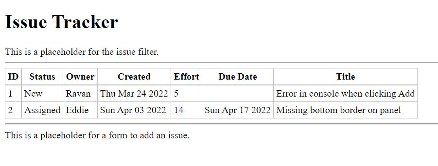

# Initial State

Until now, we only saw static components, that is, components that did not change. To make components that respond to user input and other events, React uses a data structure called state in the component. The state essentially holds the data, something that can change, as opposed to the immutable properties in the form of props that you saw earlier. This state needs to be used in the <b>render()</b> method to build the view. It is only the change of state that can change the view. When data or the state changes, React automatically rerenders the view to show the new changed data.

The state of a component is captured in a variable called this.state in the component’s class. Other things, such as the size of the window, also can change, but this is not something that affects the DOM. Even though the display changes (for example, a line may wrap because the window is narrower), the change is handled by the browser directly based on the same DOM. So, we don’t need to capture this in the state of the component

Change the loop that creates the set of IssueRows to use the state variable called issues rather than the global array

<pre>
...
  const issueRows = <b>this.state.</b>issues.map(issue => 
    <IssueRow key={issue.id} issue={issue} />
  );
...
</pre>

We already have a global array of issues; let’s rename this array to initialIssues, just to make it explicit that it is only an initial set

```js
... 
const initialIssues = [
  ...
];
```

Setting the initial state needs to be done in the constructor of the component. This can be done by
simply assigning the variable <b>this.state</b> to the set of state variables and their values

```js
...
this.state = { issues: initialIsuess };
...
```

The set of all changes to use the state to render the view of IssueTable

<pre>
  ...
  <del>const issues = [</del>
  <b>const initialIssues = [</b>
    {
      id: 1, status: 'New', owner: 'Ravan', effort: 5,
      created: new Date('2018-08-15'), due: undefined,
    },
  ...
  class IssueTable extends React.Component{
    <b>constructor(){
      super();
      this.state={issues: initialIssues };
    }</b>

    render(){
      <del>const issueRows = issues.map(issue =>)</del>
      <b>cosnt issueRows = this.state.issues.map(issue => </b> 
        <IssueRow key={issue.id} issue={issue} />
      );
    ...
</pre>

Running and testing this piece of code should show no change in the application;

