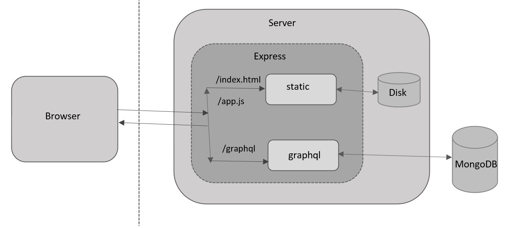
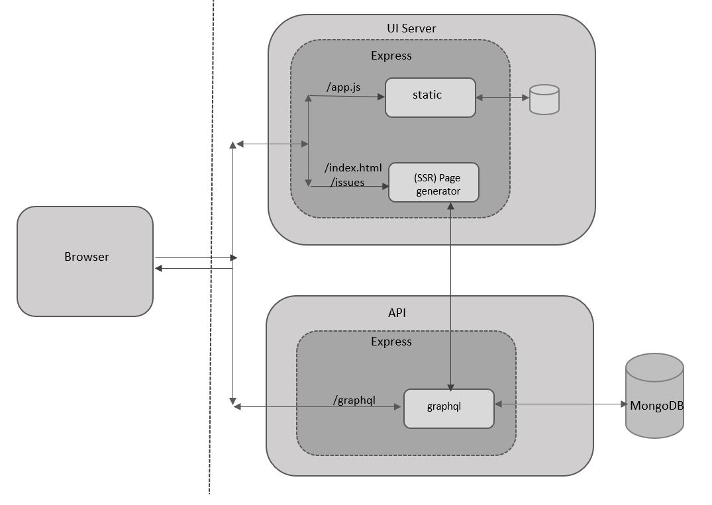
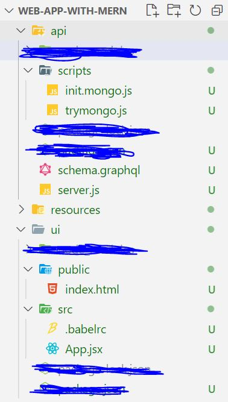

# Architecture and ESLint

In this chapter and the next, we’ll take a break from adding features. Instead, we’ll get a bit more organized in preparation for when the application grows larger and larger. 
In this chapter, we’ll look again at the architecture and make it more flexible so that it can cater to larger applications with lots of traffic. We’ll use a package called dotenv to help us run the same code on different environments using different configurations for each environment, such as development and production. 
Finally, we’ll add checks to verify that the code we write follows standards and good practices and catches possible bugs earlier in the testing cycle. We’ll use ESLint for this purpose.

## UI Server

Until now, we did not pay too much attention to the architecture of the application and the one and only
server dealt with two functions. The Express server not only serves static content, but also serves API calls. The architecture is depicted:



All requests land on the same physical server, and within that is the one and only Express application.
Then, the requests are routed into two different middleware depending on the request. Any request-matching files in the public directory are matched by the middleware called static. This middleware uses the disk to read files and serve the file’s contents. Other requests that match the /graphql path are dealt with by the Apollo Server’s middleware. This middleware, using resolvers, gets the data from the MongoDB database.<br />
This works great for small applications, but one or more of the following starts happening as the
application grows:

•	 The API has other consumers, not just the browser-based UI. For example, the API may be exposed to third parties or mobile applications.

•	 The two parts have different scaling requirements. Typically, as more consumers of the API appear, you may need multiple servers for the API and a load-balancer. Whereas, since most static content can and will be cached in the browsers, having many servers for static assets may be overkill.

Further, the fact that both functions are being done on the same server, both inside the same Node.js and Express process, makes it harder to diagnose and debug performance issues. A better option is to separate the two functions into two servers: one that serves static content, and another that hosts just the API.

Figure 7-2 depicts a new-generation architecture with the UI and the API server separated. It also shows
where server-side rendering will fit in eventually, when we do implement it.



_Figure 7-2 Seperate UI server architectures_

In the diagram in Figure 7-2, you can see that there are two servers: the UI server and the API server. These can be physically different computers, but for development purposes, we’ll run these on the same computer but on different ports. These will be run using two different Node.js processes, each with its own instance of Express.

The API server will now be responsible for handling only the API requests, and therefore, it will respond
only to URLs matching /graphql in the path. Thus, the Apollo server middleware and its requests to the
MongoDB database will be the only middleware in the API server.

The UI server part will now contain only the static middleware. In the future, when we introduce server
rendering, this server will be responsible for generating HTML pages by calling the API server’s APIs to fetch the necessary data. For the moment, we’ll be using the UI server only for serving all static content, which consists of index.html and the JavaScript bundle that contains all the React code.
The browser will be responsible for using the appropriate server based on the type of request: all API
calls will be directed to the API server, whereas the static files will be referred to the UI server.
The first thing we’ll do to achieve this is create a new directory structure that cleanly separates the UI and the API code.

 >  Ideally, the UI and API code would belong in two different repositories, because there is nothing that is shared among them. But for the convenience of reading this book we will keep code together but in different directories at the top-most level.

Let’s rename the server directory api rather than create a new one.

Since all the scripts that we have are meant only for the API server, let’s move the scripts directory under the new directory api as well.

For the UI code, let’s create a new directory called ui under the project root and move the UI-related
directories public and src under this.

But just moving the directories is not enough; we need a package.json file in each of these directories ui and api, both for saving npm dependencies as well as for creating convenient scripts for running the server. With the new package.json files and after installing all the dependencies, the new directory structure will look like:



Let’s now create two new **package.json** files in the two new directories. You could also copy this file
from the root project directory for convenience and make changes. In the file corresponding to the API, let’s use the word API in the name (for example, pro-mern-stack2-api) and the description (for example, "Pro MERN Stack (2nd Edition) API"). As for the scripts, we’ll have just one script to start the server. Since the location of the files has changed from server to the current directory, we can remove the -w option to nodemon in this script.

```js
...
  "start": "nodemon -e js,graphql server.js",
...
```

As for the dependencies, we’ll not have any devDependencies, but all the regular dependencies that
were needed for running the server. The complete package.json file is shown:

```js
{
 "name": "pro-mern-stack-2-api",
 "version": "1.0.0",
 "description": "Pro MERN Stack (2nd Edition) API",
 "main": "index.js",
 "scripts": {
  "start": "nodemon -e js,graphql server.js",
  "test": "echo \"Error: no test specified\" && exit 1"
  },
 "repository": {
  "type": "git",
  "url": "git+https://github.com/vasansr/pro-mern-stack-2.git"
  },
  "author": "vasan.promern@gmail.com",
  "license": "ISC",
  "homepage": "https://github.com/vasansr/pro-mern-stack-2",
  "dependencies": {
  "apollo-server-express": "^2.3.1",
  "express": "^4.16.4",
  "graphql": "^0.13.2",
  "mongodb": "^3.1.10",
  "nodemon": "^1.18.9"
 }
}
```

Let’s now install all the npm dependencies based on the new package.json file in the api directory:

```
 $ cd ./api
 $ npm install
```

Since we’ll be running the server from within this new api directory, we will need to load 
schema.graphql from the current directory. So let’s change code in server.js to remove the /server/
prefix from the path of schema.graphql being loaded.

<pre>
...
const server = new ApolloServer({
  typeDefs: fs.readFileSync('<del>./server/</del>schema.graphql, 'utf-8'),
...
<pre>

We can also remove loading of the static middleware and call the new server the API server rather than
the App server in the console message. The full set of changes for **api/server.js** are shown 