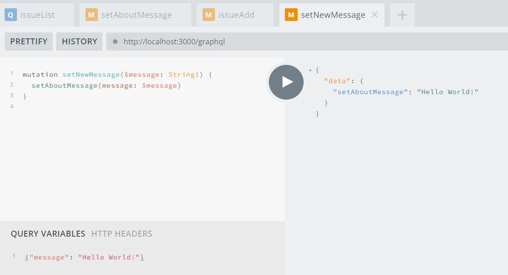

# Query Variables

For both the mutation calls, we have specified the arguments to the fields inside the query string. When trying out an API in the Playground, as we did for setAboutMessage, this works great. But in most applications, the arguments will be dynamic, based on user input. And that’s exactly what happened with
issueAdd, and we had to construct the query string using a string template.
This isn’t a great idea, firstly because of the small overhead of converting a template to the actual string. A more important reason is that special characters such as quotes and curly braces will need to be escaped. This is quite error-prone, and easy to miss. Since we have not done any escaping, if you test the Issue Tracker
application at this point in time by adding an issue that has a double quote in say, the title, you will find that it doesn’t work correctly.
GraphQL has a first-class way to factor dynamic values out of the query and pass them as a separate dictionary. These values are called _variables_.
To use variables, we have to name the operation first. This is done by specifying a name right after the query or mutation field specification. For example, to give a name to a setAboutMessage mutation, the following will have to be done:

<pre>
mutation <b>setNewMessage</b> { setAboutMessage(message: "New About Message") }
</pre>

Next, the input value has to be replaced with a variable name. Variable names start with the $ character. Let’s call the variable $message and replace the string "New About Message" with this variable. Finally, to accept the variable, we need to declare it as an argument to the operation name.

<pre>
mutation setNewMessage<b>($message: String!)</b> { setAboutMessage(message: <b>$message</b>) }
</pre>

Now, to supply the value of the variable, we need to send it across in a JSON object that is separate from the query string. In the Playground, there is a tab called QUERY VARIABLES in the bottom-right corner. Clicking on this will split the request window and allow you to type in the query variables in the bottom half.
We need to send across the variables as a JSON object with the name of the variable (without the $) as a property and its value as the property’s value.

A screenshot of the Playground, with the value of the message as "Hello World!" is shown.



If you inspect the request data in the Developer Console, you will find that the request JSON has three properties—operationName, variables, and query. While we were using only the query until now, to take advantage of variables, we’ve had to use the other two as well.

 > GraphQL specification allows multiple operations to be present in the same query string. But only one of these can be executed in one call. The value of   
 > operationName specifies which of those operations needs to be executed.

We are now ready to replace the template string with a regular string in the query, using the operation name and variable specification format. The new query string will now be like this:

```js
...
const query = `mutation issueAdd($issue: IssueInputs!) {
  issueAdd(issue: $issue) {
    id
  }
}`;
...
```

Then, while constructing the body for the fetch() request, in addition to the query property, let’s specify the variables property as well, which will contain one variable: issue. The complete set of changes in App.jsx, including this, is shown

<pre>
async createIssue(issue) {
  <del>const query = `mutation {
    issueAdd(issue: {
      title: "${issue.title}",
      owner: $"{issue.owner}",
      due: $"{issue.due.toISOString()}",
    }) {
      id
    }
  }`;</del>
  
  <b>const query = `mutation issueAdd($issue: IssueInputs!) {
    issueAdd(issue: $issue) {
      id
    }
  }`;</b>
  
  const response = await fetch('/graphql', {
    method: 'POST',
    headers: 'Content-type': 'application/json',
    body: JSON.stringify({ query, <b>variables: { issue } </b>});
  });
  this.loadData();
}
...
</pre>

On testing these changes in the Issue Tracker application, you will find that adding a new issue works as before. Further, you should be able to use double quotes in the title of a newly added issue without causing any errors.


