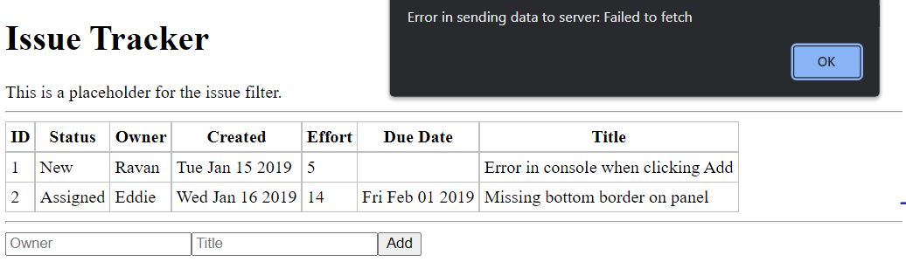
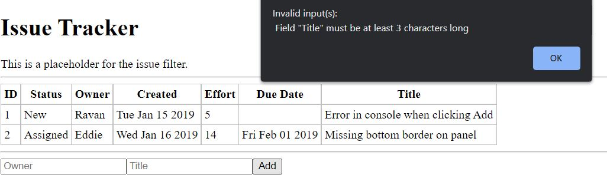

# Displaying Errors

In this section, we’ll modify the user interface to show any error messages to the user. We’ll deal with
transport errors due to network connection problems as well as invalid user input. Server and other errors should normally not occur for the user (these would most likely be bugs), and if they do, let’s just display the code and the message as we receive them.
This is a good opportunity to create a common utility function that handles all API calls and report
errors. We can replace the fetch calls within the actual handlers with this common function and display
to the user any errors as part of the API call. Let’s call this function graphQLFetch. This will be an async function since we’ll be calling fetch() using await. Let’s make the function take the query and the variables as two arguments:

```js
...
async function graphQLFetch(query, variables = {}) {
    ...
}
```

 > We used the ES2015 Default Function parameter to assign {} to the parameter variables in case it was 
 > not passed in by the caller. Read more about this feature at 
 > https://developer.mozilla.org/en-US/docs/Web/JavaScript/Reference/Functions/Default_parameters.

All transport errors will be thrown from within the call to fetch(), so let’s wrap the call to fetch() and the subsequent retrieval of the body and parse it within a try-catch block. Let’s display errors using alert in the catch block:

```js
...
  try {
    const response = await fetch('/graphql', {
      ...
    });
    ...
  } catch(e) {
    alert (`Error in sending data to server: ${e.message}`);
  }
...
```

The fetch operation is the same as originally implemented in issueAdd. Once the fetch is complete, we’ll look for errors as part of result.errors.

```js
...
  if (result.errors) {
    const error = result.errors[0];
...
```

The error code can be found within error.extensions.code. Let’s use this code to deal with each type
of error that we are expecting, differently. For BAD_USER_INPUT, we’ll need to join all the validation errors together and show it to the user:

```js
...
  if (error.extensions.code == 'BAD_USER_INPUT') {
    const details = error.extensions.exceptions.errors.join('\n');
    alert(`${error.message}:\n ${details}`);
  ...
```

For all other error codes, we’ll display the code and the message as they are received

```js
...
  } else {
    alert(`${error.extensions.code}: ${error.message}`);
  }
...
```

Finally, in this new utility function, let’s return result.data. The caller can check if any data was
returned, and if so, use that. The method loadData() in IssueList is the first caller. After building the query, all the code to fetch the data can be replaced with a simple call to graphQLFetch with the query. Since it is an async function, we can use the await keyword and receive the results directly to a variable called data. If the data is non-null, we can use it to set the state like this:

```js
...
async loadData() {
  ...
  const data = await graphQLFetch(query);
  if (data) {
    this.setState({ issues: data.issueList });
  }
}
```

Let’s make a similar change to createIssue method in the same class. Here, we also need to pass a
second argument, the variables, which is an object containing the issues variable. On the return path, if the data is valid, we know that the operation was successful and so we can call this.loadData(). We don’t use the return value of data except for knowing that the operation was successful.

```js
...
const data = await graphQLFetch(query, {issue});
if (data) {
  this.loadData();
}
...
```

The complete set of changes in App.jsx to display errors is shown

<pre>
...
<b>async function graphQL(query, variables = {}) {
  try {
    const response = await fetch('\graphql', {
      method: 'POST',
      headers: {'Content-Type': 'application/json'},
      body: JSON.stringify({ query, variables })
    });
    const body = await response.text();
    const result = JSON.parse(body, jsonDateReviver);

    if (result.errors) {
      const error = result.errors[0];
      if (error.extensions.code == 'BAD_USER_INPUT')
      {
        const details = error.extensions.exceptions.join('\n ');
        alert(`${error.message}:\n ${details}`);
      } else {
        alert(`${error.extensions.code}: ${error.message}`);
      }
    }
    return result.data;
  } catch(e) {
    alert(`Error in sending data to server: ${e.message}`);
  }
}</b>
...
class IssueList extends React.Component {
  ...
  async loadData() {
    const query = `query {
      ...
    }`;

    <del>const response = await fetch('/graphql', {
      method: 'POST',
      headers: {'Content-Type': 'application/json'},
      body: JSON.stringify({ query })
    });
    const body = await response.text();
    const result = JSON.parse(body, jsonDateReviver);
    this.setState({ issues: result.data.issueList });</del>
    <b>const data = await graphQLGFetch(query);
    if (data) {
      this.setState({ issues: data.issueList });
    }</b>
  }
  
  async createIssue(issue) {
    const query = `mutation issueAdd($issue: IssueInput!) {
      issueAdd(issue: $issue) {
        id
      }
    }`;

    <del>const resonse = await fetch('\graphql', {
      method: 'POST',
      headers: {'Content-Type': 'application/json'},
      body: JSON.stringify({ query, variables: { issue } })
    });</del>
    <del>this.loadData()</del>
    <b>const data = await graphQLFetch(query, { issue });
    if (data) {
      this.loadData();
    } </b>
  }
}
</pre>

To test transport errors, you can stop the server after refreshing the browser and then try to add a new
issue. If you do that, you will find the error message like the screenshot:



As for the other messages, the length of title can be tested by typing a small title in the user input. The other validations have to be tested only by temporarily changing the code, for example, by setting the status to the desired value and setting the due field to an invalid date string etc. within the IssueAdd component’s handleSubmit() method.




## Summary

In this chapter, we compared two API standards: REST and GraphQL. Although REST is widely used, we
chose GraphQL for the features and ease of implementation, given that there are tools and libraries to help us build the APIs.
GraphQL is an extremely structured API standard and is quite extensive. I covered only the basics of
GraphQL, which only included the features that were required for the Issue Tracker application at this stage. I encourage you to read more on GraphQL at https://graphql.org/. There are advanced features such
as directives and fragments, which can be helpful in reusing code for building queries. These can be quite handy in a larger project, but I will not cover these as part of this book as they are not really required for the Issue Tracker application.
Using GraphQL, you saw how to build the C and R part of CRUD in this chapter. You also saw how easy
some of the validations were to implement and how the strong type system of GraphQL helps avoid errors
and makes the APIs self-documenting. 
We will deal with U and D part of CRUD in later chapters, as and
when we build those features. In the meantime, it would be a good idea to see how to persist the data. We moved the array of issues from the browser’s memory to the server’s memory. In the next chapter, we’ll move it further, to a real database, MongoDB.

## Q&A

What are the pros and cons of using GET vs. POST for read-only API calls?

The browser can cache GET requests and return the response from the cache itself. Different browsers behave differently and it’s hard to predict the right behavior. Normally, you would want API results to never be cached, instead always fetched from the server. In such cases, using POST is safe, since browsers don’t cache the results of a POST.
But in case you really want the browser to cache certain API responses where possible, because the result is large and doesn’t change (e.g., images), GET is the only option. Or, you could use POST but deal with caching yourself (e.g., by using local storage) rather than let the browser handle it.

How would an aggregated query look, one that includes the list of issues as well as the about field?

The query can be like query { about issueList { id title created } }. In the result, you can see that both about and issueList are returned as properties of the data object.