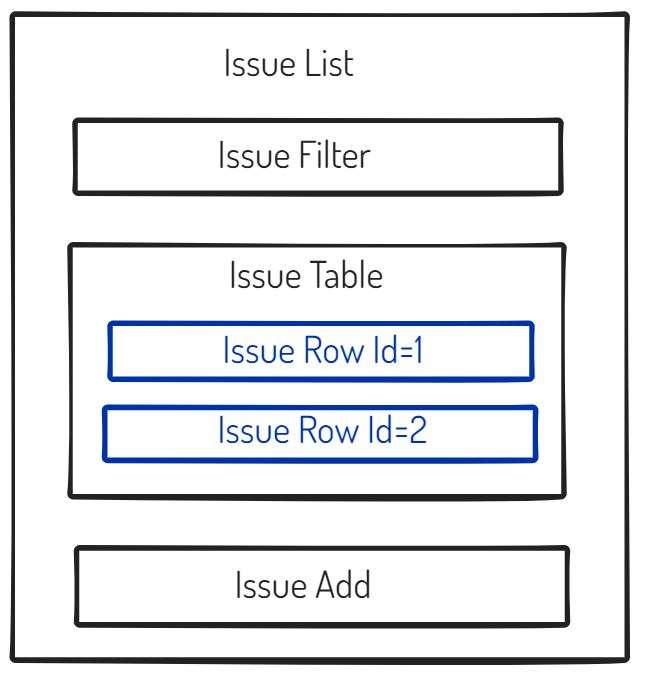

# NodeJs

## Passing data using properties

It should be possible to pass different input data from a parent component to a child component and make it render differently on different instances.

 > In the Issue Tracker application, one such component that can be instantiated with different
 > inputs is a table-row showing an individual issue. Depending on the inputs (an issue), the row  > can display different data



So, let’s create a component called IssueRow, and then use this multiple times within IssueTable,
passing in different data to show different issues, like this:

```js
...
class IssueTable extends React.Component{
    render(){
        return(
            <table>
                <thead>
                    <tr>ID</tr>
                    <tr>Title</tr>
                </thead>
                <tbody>
                    <IssueRow /> {/* somehow pass Issue1 data to this */}
                    <IssueRow /> {/* somehow pass Issue2 data to this */}
                </tbody>
            </table>
        );
    }
}
...
```

 - Note
 > JSX does not support comments natively. In order to add comments, a JavaScript snippet has to be
 > added that has JavaScript style comments. Thus, the form {/*...*/} can be used to place  
 > comments within JSX. Using HTML style comments like <!-- ... --> will not work.
 > Way to switch to the JavaScript world within any JSX snippet is to use curly braces
<br />
The easiest way to pass data to child components is using an attribute when instantiating a component.
<br />

```
...
<IssueRow issue_title="Title of the first issue" />
...
```

We used the name issue_title rather than simply title to avoid a confusion between this custom
attribute and the HTML title attribute. Now, within the render() method of the child, the attribute’s value can be accessed via a special object variable called props, which is available via the this accessor. For example, this is how the value of issue_title can be displayed within a cell in the IssueRow component:
<br />

```html
...
<td>{this.props.issue_title}</td>
...
```

So, let’s pass the issue’s title (as a string), its ID (as a number), and the row style (as an object) from IssueTable to IssueRow.
<br />

```js
class IssueRow extends React.Component{
    render(){
        const style = this.props.rowStyle;
        return (
            <tr>
                <td style={style}>{this.props.issue_id}</td>
                <td style={style}>{this.props.issue_title}</td>
            </tr>
        );
    }
  ...
}
```

A complete list of DOM elements and how attributes for these need to be specified can be found in the React Documentation at <b><https://reactjs.org/docs/dom-elements.html>.</b>
<br/>
Now that we have an IssueRow component receiving the properties, let’s pass them from the parent,
IssueTable. Style we need to pass on has a special convention of specification in React and JSX.
Rather than a CSS kind of string, React needs it to be specified as an **object** with a specific convention containing a series of JavaScript key-value pairs.
 > The keys are the same as the CSS style name, except that instead of dashes (like border-collapse)> they are camel cased (like borderCollapse)
 >> There is also a special shorthand for specifying pixel values; you can just use a number
 >> (like 4) instead of a string "4px".

```js
...
const rowStyle = {border: "1 solid silver", padding: 4};
```

This can be passed on to the IssueRow

```js
...
<IssueRow rowStyle={rowStyle} issue_id={1}
    issue_title="Error in console when clicking Add" />
...
```

Note that we are not using string-like quotes for the Issue ID since it is a number or for rowStyle since it is an object.

 - Modified IssueTable component class

```js
class IssueTable extends React.Component{
  render(){
    const rowStyle = {border: "1px solid silver", padding: 4};
      return(
        <table style={{borderCollapse: "collapse"}}>
          <thead>
            <tr>
              <th style={rowStyle}>ID</th>
              <th style={rowStyle}>Title</th>
            </tr>
          </thead>
          <tbody>
            <IssueRow rowStyle={style} issue_id={1}
              issue_title="Error in console when clicking add " />
            <IssueRow rowStyle={style} issue_id={2}
              issue_title="Missing bottom border on panel" />
            </tbody>
          </table>
        );
  }
}   
```
