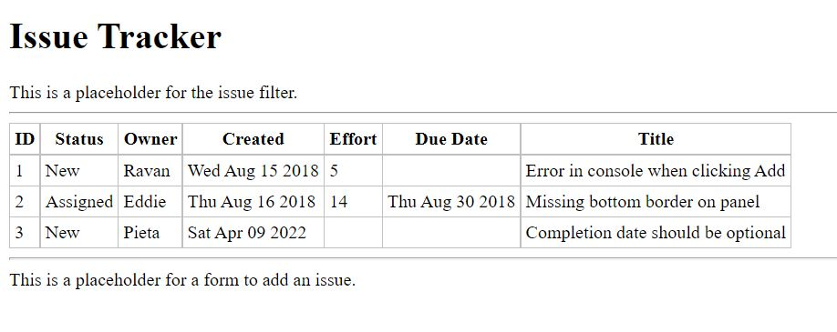

# Updating State

You saw how to set the initial state, using a direct assignment in the constructor as
well as setting a value in other lifecycle methods using `this.setState()`. Let’s add a method in IssueTable to add a new issue. This can take in as an argument an issue object, to which we’ll assign a new ID and set the creation date.

```js
...
  createIssue(issue) {
    issue.id = this.state.issues.length + 1;
    issue.created = new Date();
  }
...
```

Note that the state variable cannot be set directly, nor can it be mutated directly. That is, setting `this.state.issues` to a new value or modifying its elements is not allowed. The variable this.state in the component should always be treated as immutable. For example, the following should not be done:

```js
...
this.state.issues.push(issue)   // incorrect!
...
```

The only way to let React know something has changed, and to cause a rerender, is to call 
`this.setState()`. Further, `this.setState()` may cause the changes that are done directly to the state
variable to be overwritten. So, the following should not be done either:

```js
...
issues = this.state.issues;
issues.push(issue);       // same as this.state.issues.push(issue);
this.setState({ issues });
```

It may seem to work, but it will have unexpected consequences in some of the lifecycle methods within this as well as descendent components. What is needed in the setState() call is a fresh array of issues, say a copy of the state variable. If anyexisting array element, say an issue itself, is changing, not only is the copy of the array needed, but also the copy of the object that is being changed is needed. 

There are libraries called immutability helpers, such as immutable.js (http://facebook.github.io/immutable-js/), which can be used to construct the new state object. When a property of the object is modified, the library creates a copy optimally.

We will only append an issue, and not change an existing issue. It’s fairly straightforward to make a
shallow copy of the array, and this will suffice for the moment. So, we won’t be using the library. If, in your application, you find that you have to make lots of copies because of deep nesting of objects in the state, you could consider using `immutable.js`.

The simple way to make a copy of an array is using the slice() method

```js
...
issues = thisstate.issues.slice();
```

let’s just add a timer, on the expiry of which, a hard-coded sample issue will be appended to the list of issues. Let’s first declare this hard-coded sample issue object globally, right after the global initialIssues:

```js
...
const sampleIssue = {
  status: 'New', owner: 'Pieta',
  title: 'Completion date should be optimal'
};
...
```

Let’s use this object in a call to createIssue(), after the expiry of a timer of two seconds, in the
constructor of IssueTable:

```js
...
createIssue() {
  setTimeout(() => {
    this.createIssue(sampleIssue);
  }, 2000);
}
...
```

The final set of changes—for using a timer to append a sample issue to the list of issues

<pre>
...
const initialIssues = [{
  ...
}];
<b>const sampleIssue = {
  status: 'New', owner: 'Pieta',
  title: 'Completion date should be optional',
};</b>
...
class IssueTable extends React.Component{
  constructor() {
    super();
    <b>this.state = { issues: [] };
    setTimeout( ()=> {
      this.createIssue(sampleIssue);
    }, 2000);</b>
  }
}
...
<b>createIssue(issue) {
  issue.id = this.state.issues.length + 1;
  issue.created = new Date();
  const newIssueList = this.state.issues.split();
  newIssueList.push(issue);
  this.setState({ issues: newIssueList });
}</b>
... 
</pre>

Refreshing the browser, you’ll see that there are two rows of issues to start with. After two seconds, a third row is added with a newly generated ID and the contents of the sample issue.

